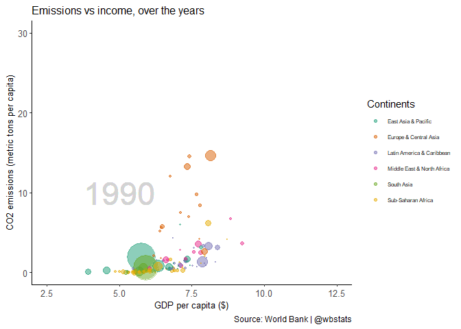

Evening
================
Cliff
2023-03-04

## R can do Fancy things

First thing first - Load the necessary packages and set plotting default

``` r
rm(list = ls())

## First specify the packages of interest
packages = c("tidyverse", "dplyr","ggplot2","plotly","viridis","gganimate","wbstats","gtrendsR","ggforce","spData","tmap")

## Now load or install&load all
package.check <- lapply(
  packages,
  FUN = function(x) {
    if (!require(x, character.only = TRUE)) {
      install.packages(x, dependencies = TRUE)
      library(x, character.only = TRUE)
    }
  }
)
```

## Including Plots

You can embed fancier plots, for example:

<!-- -->

How cool is that!
